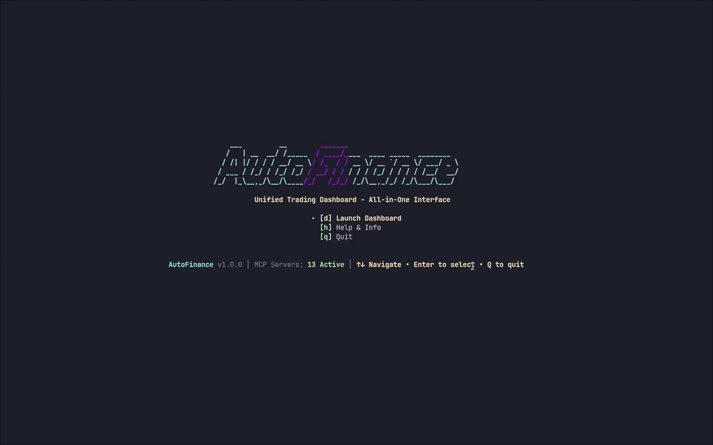
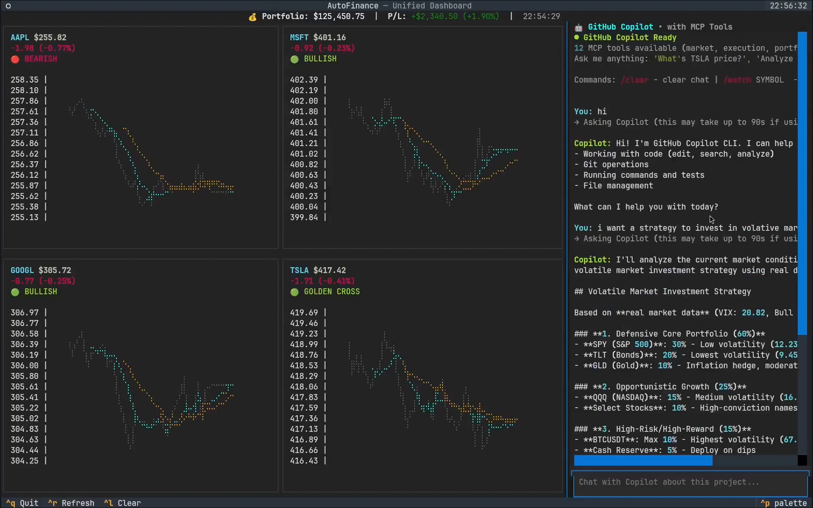
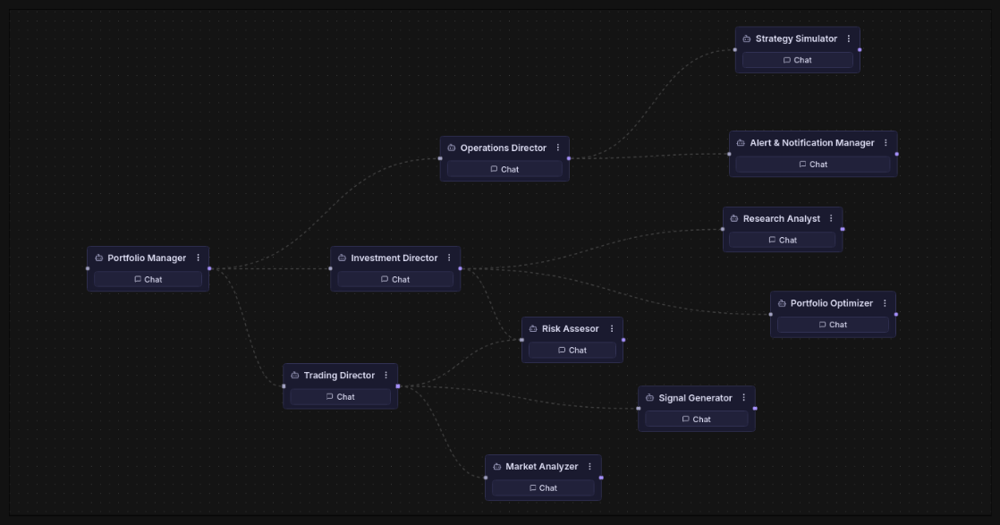

<div align="center">

# 🤖 AutoFinance

### Multi-Agent Financial AI System

[](https://opensource.org/licenses/MIT)
[](https://www.python.org/downloads/)
[](https://modelcontextprotocol.io/)
[](https://github.com/jlowin/fastmcp)
[](https://github.com/psf/black)
[](https://wemakedevs.org)

**A production-ready, enterprise-grade financial analysis system powered by 13 specialized MCP servers with real market data orchestrated by Archestra AI agents.**

[Features](#-features) • [Quick Start](#-quick-start) • [Architecture](#-architecture) • [Documentation](#-documentation) • [License](#-license)

</div>

---

## 📸 Screenshots

<div align="center">

### CLI Interface
 

### Dashboard View


### Agent Orchestration


</div>

---

## 🎯 Features

AutoFinance is an **AI-powered financial control plane** that combines:

### Core Capabilities
- 🔌 **13 Specialized MCP Servers** - Market data, technical analysis, risk management, execution, compliance
- 🤖 **12 AI Agents** - Hierarchical agent orchestration via Archestra
- 📊 **Real Market Data** - Live Yahoo Finance integration (no mocks!)
- 🛡️ **Production Governance** - Risk validation, audit logging, compliance tracking
- 📢 **Multi-Channel Notifications** - Slack, WhatsApp, SMS, Email

### Use Cases
- 📈 Short-term trading with technical analysis
- 💼 Long-term investing with fundamental research
- 🎯 Portfolio management and rebalancing
- ⚠️ Risk assessment and position validation
- 🔔 Price alerts and strategy simulations
- 📝 Comprehensive audit trails for compliance

---

## 🏗️ Architecture

### MCP Servers (13)
```
Port 9001: Market          - Real-time prices from Yahoo Finance
Port 9002: Risk            - Trade validation and position limits
Port 9003: Execution       - Portfolio state and trade execution
Port 9004: Compliance      - Audit logging and compliance metrics
Port 9005: Technical       - RSI, MACD, Bollinger Bands (real data)
Port 9006: Fundamental     - P/E, ROE, growth analysis (real data)
Port 9007: Volatility      - Historical volatility calculations (real data)
Port 9008: Portfolio       - Portfolio analytics and metrics
Port 9009: News            - Sentiment analysis (keyword-based)
Port 9010: Macro           - GDP, inflation, rates (realistic simulation)
Port 9011: Alert Engine    - Price alerts and monitors
Port 9012: Simulation      - Monte Carlo "what-if" scenarios
Port 9013: Notifications   - Multi-channel delivery
```

### Agent Hierarchy (12 Agents)
```
Level 1: Portfolio Manager (CEO)
    ├── Level 2: Trading Director
    │   ├── Level 3: Market Analyzer
    │   ├── Level 3: Signal Generator
    │   └── Level 3: Risk Assessor
    ├── Level 2: Investment Director
    │   ├── Level 3: Research Analyst
    │   └── Level 3: Portfolio Optimizer
    └── Level 2: Operations Director
        ├── Level 3: Alert Manager
        ├── Level 3: Strategy Simulator
        └── Level 3: Notification Dispatcher
```

**See [Agent_def.md](Agent_def.md) for complete agent configurations.**

---

## 🚀 Quick Start

### Prerequisites
- Python 3.14+
- Docker (for Archestra)
- Arch Linux with fish shell (or adapt commands for bash/zsh)

### 1. Install Dependencies
```bash
cd AutoFinance
. venv/bin/activate
pip install -r mcp-servers/requirements.txt
```

Key packages: `mcp>=0.9.0`, `fastmcp>=0.2.0`, `yfinance>=1.1.0`

### 2. Start All MCP Servers
```bash
./start_sse_servers.sh
```

This starts all 13 servers on ports 9001-9013. Each server uses Streamable HTTP transport on `/mcp` endpoint.

**Verify servers are running:**
```bash
ps aux | grep "mcp_sse_server.py" | grep -v grep | wc -l
# Should return: 12 or 13
```

### 3. Start Archestra
```bash
# Archestra runs in Docker on localhost:3000
docker ps | grep archestra
# If not running, start it according to Archestra docs
```

Access Archestra UI: http://localhost:3000

### 4. Configure MCP Servers in Archestra

Go to **Archestra UI → MCP Registry** and add these 13 servers:

```json
{
  "mcpServers": {
    "autofinance-market": {
      "url": "http://172.17.0.1:9001/mcp"
    },
    "autofinance-risk": {
      "url": "http://172.17.0.1:9002/mcp"
    },
    "autofinance-execution": {
      "url": "http://172.17.0.1:9003/mcp"
    },
    "autofinance-compliance": {
      "url": "http://172.17.0.1:9004/mcp"
    },
    "autofinance-technical": {
      "url": "http://172.17.0.1:9005/mcp"
    },
    "autofinance-fundamental": {
      "url": "http://172.17.0.1:9006/mcp"
    },
    "autofinance-volatility": {
      "url": "http://172.17.0.1:9007/mcp"
    },
    "autofinance-portfolio-analytics": {
      "url": "http://172.17.0.1:9008/mcp"
    },
    "autofinance-news": {
      "url": "http://172.17.0.1:9009/mcp"
    },
    "autofinance-macro": {
      "url": "http://172.17.0.1:9010/mcp"
    },
    "autofinance-alert-engine": {
      "url": "http://172.17.0.1:9011/mcp"
    },
    "autofinance-simulation-engine": {
      "url": "http://172.17.0.1:9012/mcp"
    },
    "autofinance-notification-gateway": {
      "url": "http://172.17.0.1:9013/mcp"
    }
  }
}
```

**Important:** Use `172.17.0.1` (Docker bridge IP), NOT `localhost`!

### 5. Create Agents in Archestra

Follow the detailed instructions in [Agent_def.md](Agent_def.md) to create all 12 agents with proper system prompts and tool assignments.

**Quick Agent Creation:**
1. Go to **Agents → Create New**
2. Copy Name and System Prompt from [Agent_def.md](Agent_def.md)
3. Enable listed tools from MCP servers
4. Configure sub-agents if applicable
5. Save and repeat for all 12 agents

---

## 🖥️ CLI Interface

AutoFinance includes a beautiful, intuitive terminal-based interface for interactive trading and portfolio management.

### Features
- 📊 **Live Charts** - Multiple stock/crypto charts with braille-dot graphics
- 💬 **Copilot Chat** - Interactive AI chat with MCP tool access
- 💼 **Portfolio Tracker** - Real-time portfolio value and P&L
- 🔍 **Symbol Search** - Quick search and favorites management
- ⌨️ **Keyboard Navigation** - Intuitive shortcuts, no mouse required

### Quick Start
```bash
cd cli
./install.sh      # Install dependencies
./run.sh          # Launch CLI
```

Or run directly:
```bash
cd cli
python main.py
```

### Keyboard Shortcuts
| Key | Action |
|-----|--------|
| `1` | Charts View |
| `2` | Search View |
| `3` | Chat View |
| `H` | Help |
| `R` | Refresh |
| `Q` | Quit |

### Data Sources
- **Binance** - Real-time crypto prices (WebSocket)
- **Yahoo Finance** - Stock market data (polling)
- Both sources work without API keys for public data

For complete CLI documentation, see [cli/CLI_README.md](cli/CLI_README.md)

---

## 🧪 Testing

### Run All Tests
```bash
cd tests
python test_all_servers.py
```

This runs 8 comprehensive test scripts covering all major servers.

### Run Individual Tests
```bash
cd tests
python test_market_server.py       # Test real Yahoo Finance data
python test_technical_server.py    # Test RSI, MACD, Bollinger Bands
python test_fundamental_server.py  # Test P/E, ROE, fundamental analysis
python test_volatility_server.py   # Test volatility calculations
python test_news_server.py         # Test sentiment analysis
python test_macro_server.py        # Test macro indicators
python test_risk_server.py         # Test risk validation
python test_execution_server.py    # Test portfolio execution
```

### Expected Test Results
```
✅ 100% Real Data:
- AAPL: $255.78 (Yahoo Finance)
- BTC: $69,690, 67.43% volatility
- MSFT: P/E 25.13, 48.5% upside potential

✅ All Indicators Working:
- RSI, MACD, Bollinger Bands from real prices
- P/E ratios, ROE, profit margins from ticker.info
- Volatility with log returns and annualization

✅ Risk Management:
- 5% max position size enforced
- 70% minimum confidence threshold
- Trade rejections working correctly
```

---

## 📊 Real Data Examples

### Market Data (Port 9001)
```python
# Get live AAPL price
→ get_live_price("AAPL")
← {"symbol": "AAPL", "price": 255.78, "change_24h": -2.3, "source": "yahoo_finance"}
```

### Technical Analysis (Port 9005)
```python
# Generate signal for Apple
→ generate_signal("AAPL", "3mo")
← {
    "signal": "HOLD",
    "confidence": 0.4,
    "indicators": {
        "rsi": 50.56,
        "macd": 1.09,
        "sma_20": 262.09,
        "current_price": 255.78
    },
    "reasons": ["Below SMA20", "Neutral RSI"],
    "source": "yahoo_finance",
    "data_points": 62
}
```

### Fundamental Analysis (Port 9006)
```python
# Analyze Apple fundamentals
→ analyze_fundamentals("AAPL")
← {
    "recommendation": "BUY",
    "confidence": 0.7,
    "scores": {
        "valuation": 0.25,
        "quality": 0.8,
        "growth": 0.85
    },
    "fundamentals": {
        "market_cap": 3.76e12,
        "pe_ratio": 32.38,
        "roe": 1.5202,
        "profit_margin": 0.2704,
        "target_price": 292.15
    },
    "source": "yahoo_finance"
}
```

### Volatility Analysis (Port 9007)
```python
# Check Bitcoin volatility
→ get_volatility_score("BTCUSDT")
← {
    "volatility_pct": 67.43,
    "risk_level": "HIGH",
    "risk_score": 0.889,
    "regime": "EXTREME",
    "percentile": 98.2,
    "source": "yahoo_finance"
}
```

---

## 🎭 Demo Scenarios

### Scenario 1: Trading Flow
```
User → Portfolio Manager:
"Should I buy 10 shares of Apple?"

Portfolio Manager → Trading Director
Trading Director → Market Analyzer: Get current price
Trading Director → Signal Generator: Get technical signal
Trading Director → Risk Assessor: Pre-validate

Results flow back:
- Market: AAPL at $255.78
- Technical: HOLD (RSI 50.56, downtrend)
- Fundamental: BUY (strong company, undervalued)
- Risk: Position OK (2.5% of portfolio)

Trading Director → Risk Server: validate_trade()
Risk Server → ✅ APPROVED

Trading Director → Execution Server: execute_trade()
Execution Server → ✅ FILLED

Trading Director → Compliance Server: log_event()
Compliance Server → ✅ LOGGED

Final result → User: "Trade executed. You now own 10 AAPL @ $255.78"
```

### Scenario 2: Investment Research
```
User → Portfolio Manager:
"Give me a long-term investment analysis for Microsoft"

Portfolio Manager → Investment Director
Investment Director → Research Analyst: Deep dive on MSFT
Investment Director → Portfolio Optimizer: Check allocation

Research Analyst:
- MSFT: P/E 25.13 (reasonable for growth)
- Profit margin: 39.04% (excellent)
- ROE: 34.39% (strong)
- Target price: $596 (48.5% upside!)
- Recommendation: STRONG BUY

Portfolio Optimizer:
- Current tech allocation: 15%
- Max tech sector: 30%
- Room for 15% more tech exposure

Investment Director recommends:
"Strong BUY for long-term. Allocate 10% of portfolio to MSFT.
Excellent fundamentals, significant upside, tech sector not overweight."
```

### Scenario 3: Price Alert
```
User → Portfolio Manager:
"Alert me when Bitcoin goes above $75,000"

Portfolio Manager → Operations Director
Operations Director → Alert Manager: Create alert

Alert Manager creates rule:
- Symbol: BTCUSDT
- Condition: price > 75000
- Channel: Slack
- Status: ACTIVE

[Days later, BTC hits $75,100]

Alert Manager → Notification Dispatcher: Send alert
Notification Dispatcher → Slack:
"🚨 PRICE ALERT: Bitcoin (BTCUSDT) reached $75,100 (above your $75,000 threshold)"

Notification Dispatcher → Compliance Server: Log notification
Compliance Server → ✅ LOGGED
```

---

## 🔐 Security & Compliance

### Risk Management
- **Position Limits:** Max 5% per position (configurable)
- **Confidence Threshold:** Min 70% for trade approval
- **Portfolio Risk Cap:** Max 30% total risk exposure
- **Two-Phase Validation:** Pre-assessment + formal Risk server approval

### Compliance & Audit
- **Event Logging:** All trades, validations, rejections logged
- **Audit Trails:** Timestamped records with trade details
- **Compliance Metrics:** Track validation rate, rejection reasons
- **Report Generation:** On-demand audit reports

### Architecture Security
- **Separation of Concerns:** Analysis agents can't execute trades
- **Zero-Trust Model:** Every trade requires Risk server approval
- **Agent Hierarchy:** Clear delegation paths, no rogue execution
- **MCP Protocol:** Standardized, secure tool invocation

---

## 🛠️ Advanced Configuration

### Adding Real News API (NewsAPI.org)
1. Sign up at https://newsapi.org/ (100 requests/day free)
2. Get API key
3. Set environment variable:
   ```bash
   export NEWS_API_KEY="your_key_here"
   ```
4. Restart news server:
   ```bash
   pkill -f "news/server.py"
   python mcp_sse_server.py news &
   ```

### Adding Real Macro Data (FRED API)
1. Sign up at https://fred.stlouisfed.org/ (unlimited free)
2. Get API key
3. Set environment variable:
   ```bash
   export FRED_API_KEY="your_key_here"
   ```
4. Restart macro server:
   ```bash
   pkill -f "macro/server.py"
   python mcp_sse_server.py macro &
   ```

### Custom Risk Policies
Edit [mcp-servers/risk/server.py](mcp-servers/risk/server.py):
```python
RISK_POLICY = {
    "max_position_size_pct": 5.0,      # Change to 10.0 for aggressive
    "max_portfolio_risk_pct": 30.0,    # Change to 50.0 for aggressive
    "min_confidence_threshold": 0.7,   # Change to 0.6 for more trades
    "max_daily_trades": 10,
    "max_leverage": 1.0
}
```

---

## 📁 Project Structure

```
AutoFinance/
├── mcp-servers/                    # 13 MCP server implementations
│   ├── market/server.py           # Yahoo Finance integration
│   ├── risk/server.py             # Risk validation logic
│   ├── execution/server.py        # Portfolio state & trades
│   ├── compliance/server.py       # Audit logging
│   ├── technical/server.py        # RSI, MACD, Bollinger Bands
│   ├── fundamental/server.py      # P/E, ROE, fundamentals
│   ├── volatility/server.py       # Volatility calculations
│   ├── news/server.py             # Sentiment analysis
│   ├── macro/server.py            # GDP, inflation, rates
│   ├── portfolio-analytics/server.py  # Portfolio metrics
│   ├── alert-engine/server.py     # Price alerts
│   ├── simulation-engine/server.py    # Monte Carlo simulations
│   ├── notification-gateway/server.py # Multi-channel notifications
│   ├── llm_client.py              # LLM integration utilities
│   └── requirements.txt           # Python dependencies
├── cli/                           # Terminal-based interface
│   ├── main.py                    # CLI entry point
│   ├── dashboard.py               # Dashboard view
│   ├── dashboard_textual.py       # Textual-based dashboard
│   ├── config.yaml                # CLI configuration
│   ├── CLI_README.md              # CLI documentation
│   ├── install.sh                 # Installation script
│   ├── run.sh                     # Launch script
│   ├── components/                # UI components
│   │   ├── charts.py
│   │   ├── chatbox.py
│   │   ├── portfolio.py
│   │   └── search.py
│   ├── data/                      # Data fetchers
│   │   └── fetchers.py
│   └── utils/                     # Utilities
│       └── keyboard.py
├── tests/                         # Comprehensive test suite
│   ├── test_market_server.py
│   ├── test_technical_server.py
│   ├── test_fundamental_server.py
│   ├── test_volatility_server.py
│   ├── test_news_server.py
│   ├── test_macro_server.py
│   ├── test_risk_server.py
│   ├── test_execution_server.py
│   ├── test_all_servers.py        # Master test runner
│   └── README.md                  # Testing documentation
├── mcp_sse_server.py              # Main server wrapper
├── start_sse_servers.sh           # Startup script
├── alert_monitor.py               # Alert monitoring daemon
├── Agent_def.md                   # Agent configurations
├── README.md                      # This file
├── LICENSE                        # MIT License
├── .gitignore                     # Git ignore rules
└── venv/                          # Python virtual environment
```

---

### Future Enhancements
- 🎯 Add investor features (retirement planning, diversification scoring)
- 📊 Integrate paid APIs (Bloomberg, Refinitiv) for institutional data
- 🔄 Implement backtesting engine for strategy validation
- 🌐 Add web UI for direct user interaction
- ☁️ Deploy to cloud (AWS, GCP, Azure) with Kubernetes
- 📱 Mobile app integration
- 🔔 Advanced alert conditions and triggers

---

## 📄 License

This project is licensed under the MIT License - see the [LICENSE](LICENSE) file for details.
